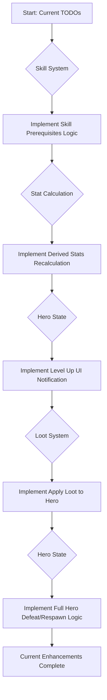

# Step by Step Feature Plan

This document tracks the progress of the current game enhancements and outlines future development steps.

## Phase 1: Original Enhancement Plan Review (Status as of 2025-05-12)

This section summarizes the progress of features outlined in the original `enhancement-plan.md`.

*   **Initial Code Review & Confirmation**
    *   **Status:** Implemented (Completed)

*   **Addressing `TODO` Items (Iterative Implementation)**
    1.  **Implement Combat Log UI**
        *   **Status:** Implemented
        *   **Details:** Combat messages are displayed in the `<div id="combat-log">` via [`src/utils/ui_logger.js`](src/utils/ui_logger.js).

    2.  **Implement Skill System: Learning & Button States**
        *   **Status:** Partially Implemented
        *   **Completed:**
            *   Hero can learn skills, deduct skill points, and apply immediate passive effects ([`src/entities/hero.js`](src/entities/hero.js)).
            *   Skill buttons in UI update based on cost and learned status ([`src/scenes/main_scene.js`](src/scenes/main_scene.js)).
        *   **Remaining TODOs:**
            *   Implement prerequisite checks for learning skills ([`src/entities/hero.js`](src/entities/hero.js) and [`src/scenes/main_scene.js`](src/scenes/main_scene.js)).

    3.  **Implement Stat Calculation: Derived Stats**
        *   **Status:** Not Implemented
        *   **Remaining TODOs:**
            *   Create and call a `recalculateDerivedStats()` method in `Hero` class after attribute points are spent or passive skills affecting primary stats are learned ([`src/entities/hero.js`](src/entities/hero.js)).

    4.  **Implement Hero State: Level Up UI Notification**
        *   **Status:** Not Implemented
        *   **Completed:**
            *   Core level-up logic (XP, points, basic stat increases) exists and logs to combat log ([`src/entities/hero.js`](src/entities/hero.js)).
        *   **Remaining TODOs:**
            *   Implement a distinct visual UI notification for level-ups beyond the combat log message ([`src/entities/hero.js`](src/entities/hero.js) and potentially [`src/scenes/main_scene.js`](src/scenes/main_scene.js)).

    5.  **Implement Loot System: Apply Loot**
        *   **Status:** Partially Implemented
        *   **Completed:**
            *   Loot (with stat modifiers) is generated upon enemy defeat ([`src/systems/combat_manager.js`](src/systems/combat_manager.js), [`src/systems/loot_table.js`](src/systems/loot_table.js)).
        *   **Remaining TODOs:**
            *   Apply generated loot modifiers to hero stats or manage through a basic equipment system ([`src/systems/combat_manager.js`](src/systems/combat_manager.js), [`src/entities/hero.js`](src/entities/hero.js)). The current `hero.equipment` map is a starting point.

    6.  **Implement Hero State: Hero Defeat Logic**
        *   **Status:** Partially Implemented
        *   **Completed:**
            *   Hero defeat is recognized, and auto-combat stops ([`src/systems/combat_manager.js`](src/systems/combat_manager.js)).
        *   **Remaining TODOs:**
            *   Implement full respawn logic (e.g., health reset, potential penalties like XP/currency loss) and UI feedback (e.g., "Defeated" message, respawn button) ([`src/systems/combat_manager.js`](src/systems/combat_manager.js)).

## Phase 2: Completing Current Enhancements

This phase focuses on completing the remaining `TODO` items from the original enhancement plan.



**Detailed Steps for Completing Current Enhancements:**

1.  **Skill System: Prerequisites**
    *   **Goal:** Prevent learning skills if prerequisites are not met.
    *   **Tasks:**
        *   Define prerequisite structure in [`src/config/constants.js`](src/config/constants.js) if not already present.
        *   Implement prerequisite checking logic in `Hero.learnSkill()` ([`src/entities/hero.js`](src/entities/hero.js)).
        *   Update `skillButtonUpdater` in [`src/scenes/main_scene.js`](src/scenes/main_scene.js) to disable buttons based on unmet prerequisites.

2.  **Stat Calculation: Derived Stats**
    *   **Goal:** Ensure stats dependent on primary attributes (STR, INT, AGI) or other stats are updated correctly.
    *   **Tasks:**
        *   Identify all derived stats (e.g., `maxHealth` from STR, damage from STR/INT, `maxStamina` from AGI).
        *   Create `Hero.recalculateDerivedStats()` method in [`src/entities/hero.js`](src/entities/hero.js).
        *   Call this method in `Hero.spendAttributePoint()` and after passive skills that modify base stats are learned.

3.  **Hero State: Level Up UI Notification**
    *   **Goal:** Provide a clear, non-combat-log visual notification for level-ups.
    *   **Tasks:**
        *   Design the notification (e.g., temporary text on Phaser canvas, a styled HTML element).
        *   Implement the display logic within `Hero.levelUp()` or trigger an event for [`src/scenes/main_scene.js`](src/scenes/main_scene.js) to handle.

4.  **Loot System: Apply Loot**
    *   **Goal:** Make loot actually benefit the hero.
    *   **Tasks:**
        *   In `CombatManager.handleEnemyDefeat()` ([`src/systems/combat_manager.js`](src/systems/combat_manager.js)):
            *   Iterate through `loot.modifiers` from [`src/systems/loot_table.js`](src/systems/loot_table.js).
            *   Directly apply stat bonuses to `this.hero.stats`.
            *   Consider if loot should be "equipped" into `hero.equipment` slots if it's an item (future extension: for now, direct stat application is fine).
            *   Update combat log with details of applied stats.

5.  **Hero State: Hero Defeat Logic**
    *   **Goal:** Implement consequences and recovery from hero defeat.
    *   **Tasks:**
        *   In `CombatManager.handleHeroDefeat()` ([`src/systems/combat_manager.js`](src/systems/combat_manager.js)):
            *   Reset hero's health to full.
            *   Implement optional penalties (e.g., lose a percentage of current XP, or a small amount of a future "gold" currency).
            *   Display a "You were defeated!" message.
            *   Provide a "Respawn" button or mechanism to re-engage combat (possibly after a short delay).
            *   Restart auto-combat upon respawn.

## Phase 3: Future Feature Roadmap

Once the current enhancements are complete, the following features from [`Idle & Incremental Game Features.txt`](Idle & Incremental Game Features.txt) can be considered for implementation to expand the game.

```mermaid
graph TD
    G[Current Enhancements Complete] --> H{Introduce Gold Currency};
    H --> I[Basic Equipment System (Beyond Stat Sticks)];
    I --> J[Prestige System];
    J --> K[Achievements];
    K --> L[More Idle Game Features...];
```

**Potential Future Features:**

1.  **Gold Currency & Basic Economy**
    *   **Concept:** Introduce "Gold" as a primary currency.
    *   **Source:** Dropped by enemies, quest rewards (future).
    *   **Uses:** Buying equipment upgrades (future), skill respecs (future), prestige costs (future).
    *   **Impact:** Foundation for many other systems. Hero defeat penalty could include gold loss.

2.  **Enhanced Equipment System**
    *   **Concept:** Expand beyond simple stat modifiers from loot. Actual equipment items (Weapon, Armor, Accessories) that can be equipped/unequipped.
    *   **Details:**
        *   Loot drops actual items with names, rarities, and specific stats.
        *   Hero has dedicated equipment slots.
        *   UI to manage equipment.
    *   **Impact:** Deeper character customization and progression.

3.  **Prestige Mechanic**
    *   **Concept:** Allow players to reset their current progress (level, possibly some stats/skills) in exchange for permanent global bonuses or a special "prestige currency."
    *   **Details:**
        *   Define prestige requirements (e.g., reach level X).
        *   Define prestige rewards (e.g., +% XP gain, +% gold find, +% all stats).
    *   **Impact:** Increases replayability and long-term engagement, a core of idle games.

4.  **Achievements System**
    *   **Concept:** A set of goals for players to accomplish, providing rewards or recognition.
    *   **Details:**
        *   Examples: Defeat X enemies, reach level Y, learn Z skills, acquire N rare items.
        *   Rewards: Small stat boosts, currency, cosmetic changes (future).
        *   UI to display achievements and progress.
    *   **Impact:** Provides short and long-term goals, encourages exploration of game mechanics.

5.  **Offline Earnings**
    *   **Concept:** Allow the hero to continue "fighting" and earning XP/Gold while the game is closed.
    *   **Details:**
        *   Calculate earnings based on time offline and current progression (e.g., hero level, current enemy tier).
        *   Present earnings upon next login.
    *   **Impact:** Key feature for idle games, rewarding players for returning.

---

This plan will be updated as features are implemented and new ideas emerge.