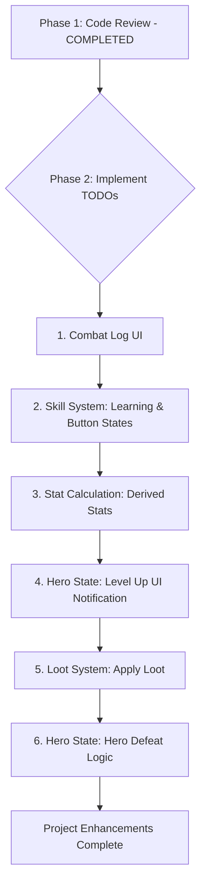

# Idle RPG Enhancement Plan

## Phase 1: Initial Code Review & Confirmation (Completed)

*   **Status:** Done.
*   **Outcome:**
    *   [`index.html`](index.html), [`style.css`](style.css), and [`game.js`](game.js) are correctly linked.
    *   Phaser is set up correctly and targets the appropriate `div`.
    *   DOM elements referenced in [`game.js`](game.js) exist in [`index.html`](index.html).
    *   No immediate syntax errors were found in the reviewed files.

## Phase 2: Addressing `TODO` Items (Iterative Implementation)

This phase will involve implementing the features marked as `TODO` in [`game.js`](game.js). We will tackle them in a logical order to build out the game's functionality.

Here's a visual overview of the proposed steps:

**Detailed Steps for Phase 2:**

1.  **Implement Combat Log UI**
    *   **Goal:** Display combat messages (hero attacks, enemy attacks, damage taken, etc.) in the `
` ([`index.html:24`](index.html:24)) instead of just `console.log`.
    *   **Files Involved:** [`game.js`](game.js) (primarily), [`style.css`](style.css) (for potential styling of log messages).
    *   **Approach:**
        *   Create a new function in [`game.js`](game.js), e.g., `logMessage(message)`, that appends new messages to the `combat-log` div.
        *   Modify existing `console.log` statements related to combat events (e.g., in `Hero.attack`, `Hero.takeDamage`, `Enemy.attack`, `Enemy.takeDamage`, `CombatManager.resolveCombatRound`) to also call this new `logMessage` function.
        *   Consider adding a maximum number of log entries or a way to scroll if the log becomes too long.

2.  **Implement Skill System: Learning & Button States**
    *   **Goal:** Allow the hero to learn passive and active skills using skill points, and update the UI to reflect learnable/learned skills.
    *   **Files Involved:** [`game.js`](game.js).
    *   **Approach:**
        *   **Learning Skills (`TODO` at [`game.js:359`](game.js:359)):**
            *   Implement event listeners for the skill buttons created in `populateSkillTreeUI`.
            *   When a skill button is clicked:
                *   Check if the hero has enough skill points.
                *   Check if prerequisites (if any, currently empty in definitions) are met.
                *   If learnable, deduct skill points, add the skill to `hero.learnedPassiveSkills` or `hero.learnedActiveSkills`.
                *   Apply the skill's immediate effects (e.g., stat boosts for passives).
                *   Update the UI (e.g., disable the button, change its appearance).
        *   **Button States (`TODO` at [`game.js:395`](game.js:395)):**
            *   In the `update` loop of the Phaser scene, iterate through the skill buttons.
            *   Enable/disable skill buttons based on:
                *   Available skill points.
                *   Whether the skill is already learned.
                *   Prerequisites.

3.  **Implement Stat Calculation: Derived Stats**
    *   **Goal:** Recalculate stats that might depend on primary attributes (STR, INT, AGI) whenever an attribute point is spent.
    *   **Files Involved:** [`game.js`](game.js) (specifically the `Hero` class).
    *   **Approach (`TODO` at [`game.js:94`](game.js:94)):**
        *   Identify which stats are "derived" (e.g., `maxHealth` could be influenced by STR, `maxStamina` by AGI, base damage by STR, etc. – current implementation is basic).
        *   Create a method in the `Hero` class, e.g., `recalculateDerivedStats()`.
        *   Call this method within `spendAttributePoint()` after a point is successfully spent.
        *   Adjust formulas for derived stats as needed (e.g., `this.stats.maxHealth = 50 + this.stats.str * 5;`).

4.  **Implement Hero State: Level Up UI Notification**
    *   **Goal:** Provide a clear visual notification to the player when the hero levels up.
    *   **Files Involved:** [`game.js`](game.js), [`index.html`](index.html) (potentially for a notification element), [`style.css`](style.css) (for styling).
    *   **Approach (`TODO` at [`game.js:85`](game.js:85)):**
        *   In the `Hero.levelUp()` method:
            *   Trigger a UI update. This could be:
                *   Displaying a temporary message on the game canvas (using Phaser text objects).
                *   Showing a styled message in a dedicated notification area in the HTML UI panel.
                *   Briefly animating an element.
        *   If using an HTML element, ensure it's added to [`index.html`](index.html) and styled appropriately.

5.  **Implement Loot System: Apply Loot**
    *   **Goal:** When loot is generated after an enemy defeat, apply its effects to the hero or add it to an inventory.
    *   **Files Involved:** [`game.js`](game.js) (primarily `CombatManager` and `Hero` classes).
    *   **Approach (`TODO` at [`game.js:276`](game.js:276)):**
        *   In `CombatManager.handleEnemyDefeat()`:
            *   After `loot.generateLoot()`, decide how to handle `loot.modifiers`.
            *   **Option 1 (Direct Application):** If loot provides direct stat boosts, update `this.hero.stats` accordingly.
            *   **Option 2 (Equipment/Inventory):**
                *   Define a simple equipment or inventory system in the `Hero` class if not just applying stats directly.
                *   The current `hero.equipment` map is a good start.
                *   Decide if loot replaces existing equipment or is added to a list.
                *   Update hero stats based on equipped items.
        *   Log the acquired loot and its effects to the (newly implemented) combat log.

6.  **Implement Hero State: Hero Defeat Logic**
    *   **Goal:** Define what happens when the hero's health reaches zero.
    *   **Files Involved:** [`game.js`](game.js) (primarily `CombatManager` and the Phaser scene), [`index.html`](index.html) (for potential UI changes like a "Game Over" screen).
    *   **Approach (`TODO` at [`game.js:291`](game.js:291)):**
        *   In `CombatManager.handleHeroDefeat()`:
            *   Stop auto-combat (already done).
            *   **Respawn Logic:**
                *   Reset hero's health to full.
                *   Apply penalties (e.g., XP loss, gold loss - requires gold system).
                *   Move hero to a starting location (if applicable in a more complex map).
            *   **UI Changes:**
                *   Display a "Defeated" or "Game Over" message.
                *   Temporarily disable certain UI controls.
                *   Offer a "Respawn" button.
            *   Restart auto-combat or require player action to continue.