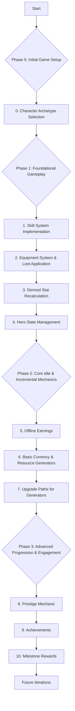

# New Idle RPG Development Plan

This plan integrates features from the user-provided `Idle & Incremental Game Features.txt` with the existing codebase and previously identified TODOs.

## Visual Overview of Phases

## Phase 0: Initial Game Setup

**0. Character Archetype Selection**
    *   **Goal:** Allow players to choose a starting archetype with unique characteristics before the game begins.
    *   **Details:**
        *   Define 2-3 distinct archetypes (e.g., Warrior: +STR, +Health; Mage: +INT, +StaminaRegen; Rogue: +AGI, +Stamina).
        *   Each archetype will have specific initial adjustments to base stats.
        *   Consider if archetypes should start with a very basic, unique passive skill or a specific equipment piece (e.g., Warrior starts with a slightly better sword, Mage with a staff that gives +1 INT).
        *   Develop a UI screen (modal or full screen) that appears on new game start, allowing players to view and select an archetype.
        *   Modify the `Hero` class constructor and initialization logic in `CombatManager` or the main game scene to set up the hero based on the chosen archetype.
        *   The main game loop and combat should only commence after an archetype has been selected.
    *   **Files Involved:** [`game.js`](game.js) (Hero class, game scene `create` method), [`index.html`](index.html) (for the new UI elements), [`style.css`](style.css) (for styling the selection screen).

## Phase 1: Foundational Gameplay Enhancements

**1. Skill System Implementation:**
    *   **Goal:** Fully implement the skill learning and usage system.
    *   **Details:**
        *   Allow hero to learn passive and active skills using skill points.
        *   Implement event listeners for skill buttons in the UI.
        *   Manage skill point deduction and skill acquisition.
        *   Apply immediate effects of passive skills.
        *   Enable/disable skill buttons based on skill points, prerequisites, and learned status.
        *   (Corresponds to "Skill Trees" & "Skill Development" from features list)
    *   **Files Involved:** [`game.js`](game.js)

**2. Equipment System & Loot Application:**
    *   **Goal:** Implement a functional equipment system where loot affects hero stats.
    *   **Details:**
        *   When loot drops, apply its stat modifiers to the hero if it's an upgrade or an empty slot.
        *   Allow equipping/unequipping items (initially weapon and armor as defined in `Hero.equipment`).
        *   Hero's combat stats should dynamically update based on equipped items.
        *   (Corresponds to "Equipment System" from features list)
    *   **Files Involved:** [`game.js`](game.js)

**3. Derived Stat Recalculation:**
    *   **Goal:** Ensure hero stats correctly update from all relevant sources.
    *   **Details:**
        *   Create/refine a method in the `Hero` class to recalculate all derived stats (e.g., `maxHealth`, `damage`, `defense`) whenever base attributes (STR, INT, AGI) change or equipment is updated.
    *   **Files Involved:** [`game.js`](game.js)

**4. Hero State Management:**
    *   **Goal:** Implement clear feedback for level-ups and consequences for defeat.
    *   **Details:**
        *   **Level Up UI Notification:** Provide a visual cue (e.g., temporary text on canvas or UI panel) when the hero levels up.
        *   **Hero Defeat Logic:**
            *   Stop combat.
            *   Implement a basic respawn mechanism (e.g., hero health restored).
            *   Consider a minor penalty (e.g., small XP loss, or a short "downtime" before combat resumes).
            *   Display a "Defeated" message.
    *   **Files Involved:** [`game.js`](game.js), potentially [`index.html`](index.html)/[`style.css`](style.css) for UI elements.

## Phase 2: Core Idle & Incremental Mechanics

**5. Offline Earnings:**
    *   **Goal:** Allow players to accumulate resources while the game is not running.
    *   **Details:**
        *   Store the timestamp when the game is closed (e.g., using `localStorage`).
        *   On game load, calculate the time elapsed since the last session.
        *   Award a base amount of XP (and later, basic currency) based on this offline duration and current progression level (e.g., hero level or main generator level).
        *   Display a summary of offline earnings.
        *   (Corresponds to "Offline Earnings" from features list)
    *   **Files Involved:** [`game.js`](game.js)

**6. Basic Currency & Resource Generators:**
    *   **Goal:** Introduce a primary in-game currency and ways to generate it actively and passively.
    *   **Details:**
        *   Introduce "Gold" as a new currency.
        *   Enemies drop Gold upon defeat.
        *   Add a "Gold Stash" display in the UI.
        *   Introduce a simple "Gold Mine" (or similar) generator that players can purchase. This generator produces Gold per second.
        *   (Corresponds to "Multiple Currencies" & "Generators" from features list)
    *   **Files Involved:** [`game.js`](game.js), [`index.html`](index.html), [`style.css`](style.css)

**7. Upgrade Paths for Generators:**
    *   **Goal:** Allow players to improve their resource generation.
    *   **Details:**
        *   Allow players to spend Gold to upgrade their "Gold Mine" (or other generators introduced).
        *   Each upgrade increases the Gold-per-second output of the generator.
        *   Upgrade costs should scale.
        *   Update UI to show generator levels and production rates.
        *   (Corresponds to "Upgrade Paths" from features list)
    *   **Files Involved:** [`game.js`](game.js), [`index.html`](index.html), [`style.css`](style.css)

## Phase 3: Advanced Progression & Engagement Features

**8. Prestige Mechanic (Simplified First Version):**
    *   **Goal:** Introduce a system for resetting progress to gain permanent bonuses, encouraging replayability.
    *   **Details:**
        *   Define a "Prestige" action that becomes available after reaching a certain milestone (e.g., hero level 100 or a high generator level).
        *   Prestige resets: hero level, Gold, generator levels, current XP.
        *   Prestige awards: "Prestige Points" or a permanent global bonus (e.g., +X% to all Gold earnings, +Y% to XP gain).
        *   Learned skills and possibly equipment could be retained or handled differently.
        *   (Corresponds to "Prestige Mechanics" from features list)
    *   **Files Involved:** [`game.js`](game.js), [`index.html`](index.html), [`style.css`](style.css)

**9. Achievements (Basic Implementation):**
    *   **Goal:** Provide players with goals and a sense of accomplishment.
    *   **Details:**
        *   Track simple achievements (e.g., "Reach Hero Level 10," "Defeat 100 Enemies," "Earn 1000 Gold," "First Prestige").
        *   Create a simple UI section to display locked/unlocked achievements.
        *   Potentially offer small, one-time rewards for completing achievements (e.g., a few skill points, a small amount of Gold).
        *   (Corresponds to "Achievements" from features list)
    *   **Files Involved:** [`game.js`](game.js), [`index.html`](index.html), [`style.css`](style.css)

**10. Milestone Rewards:**
    *   **Goal:** Reward players for significant progression points.
    *   **Details:**
        *   Define specific milestones (e.g., "First time equipping a Rare item," "Unlocking Active Skill X," "Reaching Generator Level Y").
        *   Award one-time bonuses upon reaching these milestones (e.g., a sum of Gold, a few attribute/skill points, a specific item if the system supports it).
        *   (Corresponds to "Milestone Rewards" from features list)
    *   **Files Involved:** [`game.js`](game.js)

## Features to Consider for Later Iterations

*   Narrative Elements / Storylines
*   Social Features (Leaderboards, Guilds)
*   Pet Companions
*   Daily Rewards
*   Advanced Visual Customization
*   Monetization Strategies